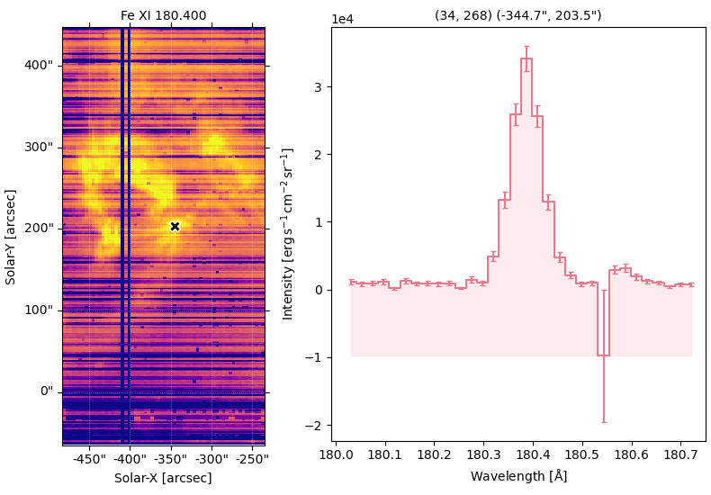
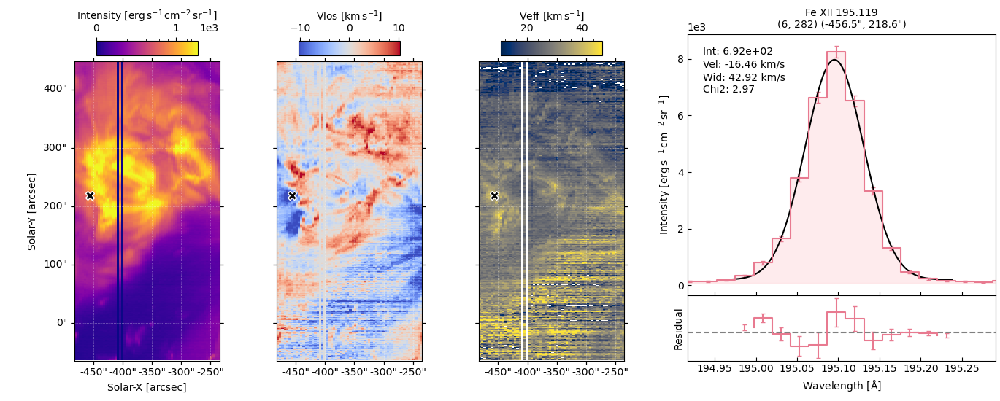

# eispac_inspector
A naive script to inspect spectral lines profiles in [eispac](https://eispac.readthedocs.io/en/latest/index.html#) level1 data files or fitting results, imitating some functions of IDL xfiles. 

The script can be called as a module or a standalone script from the command line. Users can choose inspecting only the line profiles from the level 1 *.data.h5 files or the fitting results from the *.fit.h5 files. The script will automatically detect the file type and load the data accordingly. If only a single *.fit.h5 file is provided, the script will load the corresponding *.data.h5 file automatically, searching for the file in the same directory or using the filename_data in the fit meta.

Examples: 

```bash
# run as a standalone script

# inspect line profiles in the window 0 of the level 1 data file
python eispac_inspector.py -d eis_yyyymmdd_hhmmss.*.data.h5

# inspect line profiles in around 195.119 Angstrom in the level 1 data file
python eispac_inspector.py -d eis_yyyymmdd_hhmmss.data.h5 -i 195.119

# inspect fitting results of the component 0 in the multi-Gaussian fitting result file
python eispac_inspector.py -f eis_yyyymmdd_hhmmss.*.fit.h5 -i 0

# inspect fitting results of the component 0 in the multi-Gaussian fitting result file, also specify the data file
python eispac_inspector.py -f eis_yyyymmdd_hhmmss.*.fit.h5 -d eis_yyyymmdd_hhmmss.data.h5 -i 0
```

```python
# imported as a module
from eispac_inspector import EISInspector

eis_fit_file = 'eis_yyyymmdd_hhmmss.*.fit.h5'
eis_data_file = 'eis_yyyymmdd_hhmmss.data.h5'

# inspect line profiles in the window 0 of the level 1 data file
eis_inspector = EISInspector(filename_data = eis_data_file, index=0)

# inspect line profiles in around 195.119 Angstrom in the level 1 data file
eis_inspector = EISInspector(filename_data = eis_data_file, index=195.119)

# inspect fitting results of the component 0 in the multi-Gaussian fitting result file
eis_inspector = EISInspector(filename_fit = eis_fit_file, index=0)

```

Then you can just click around and have fun exploring the spectral line profiles!

#### *.data.h5


#### *.fit.h5



